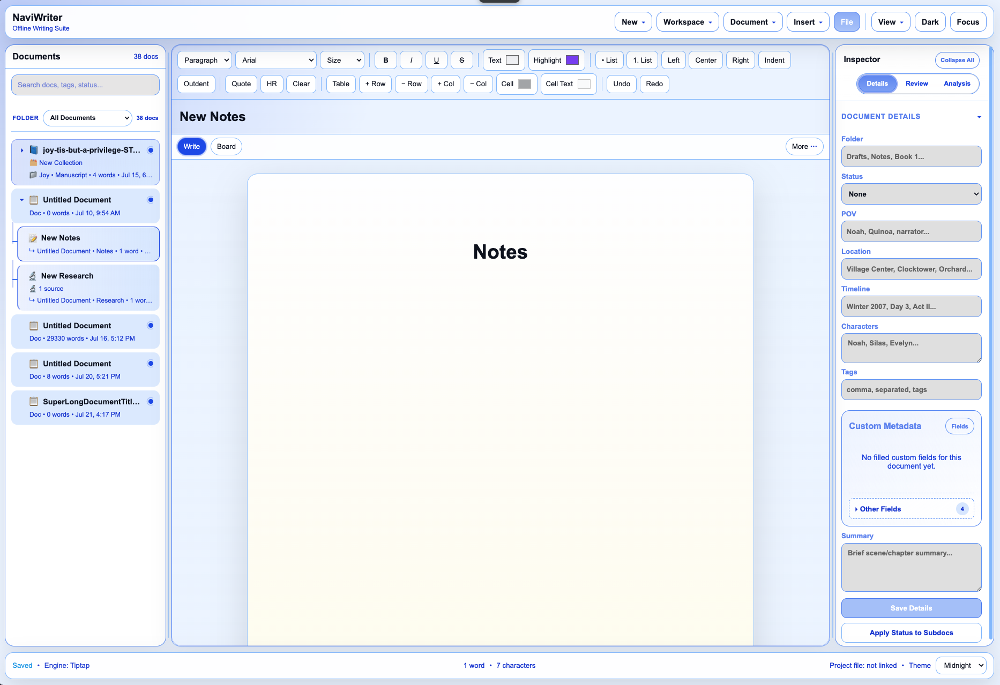
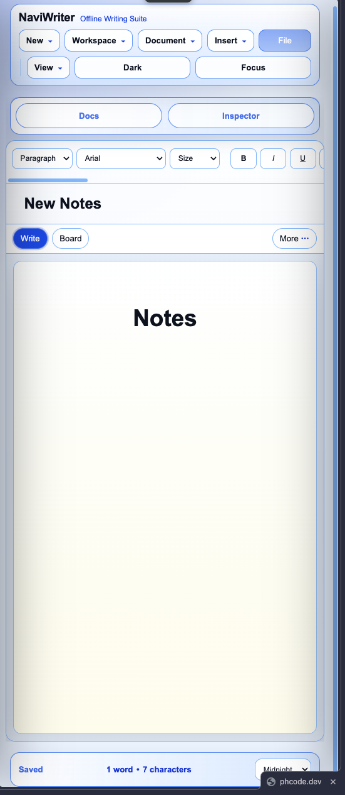
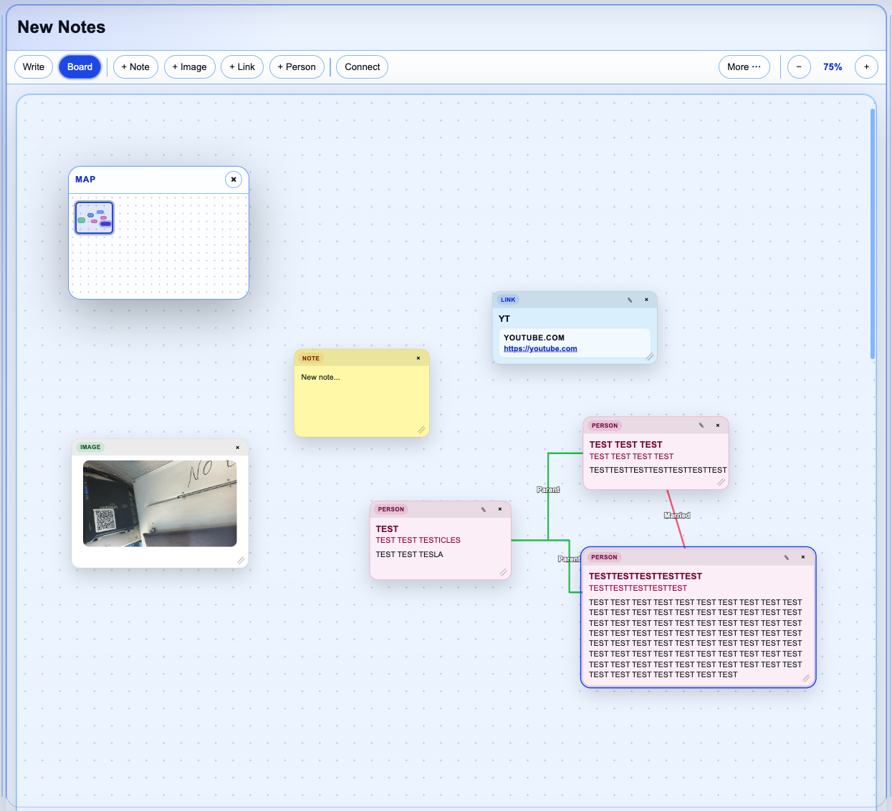
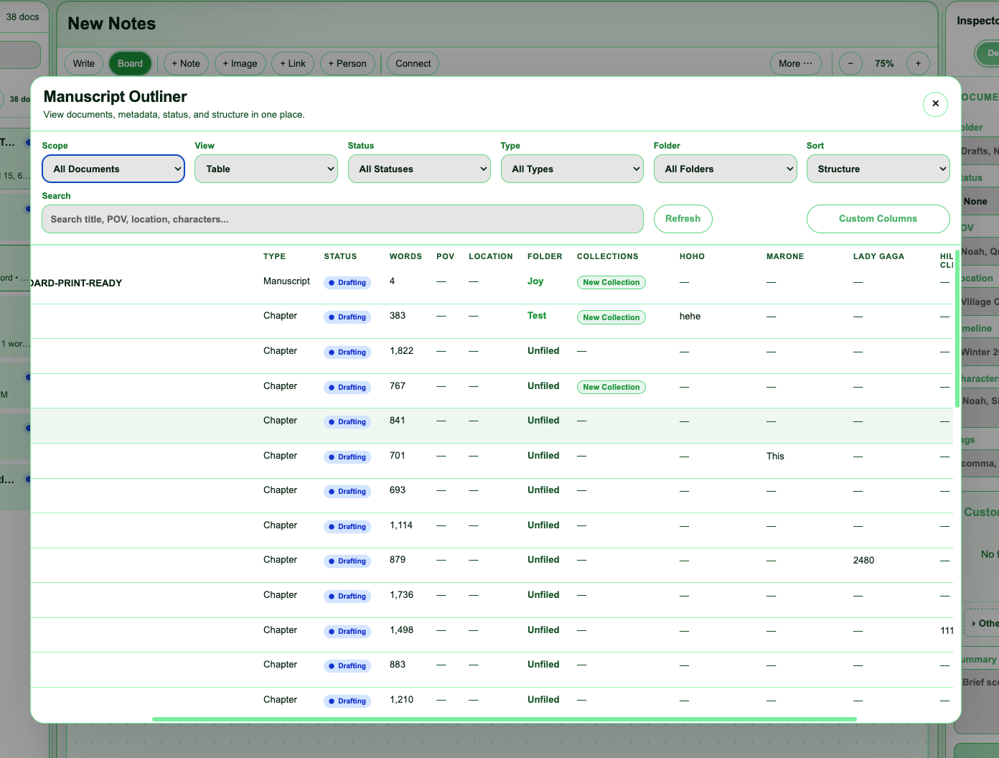
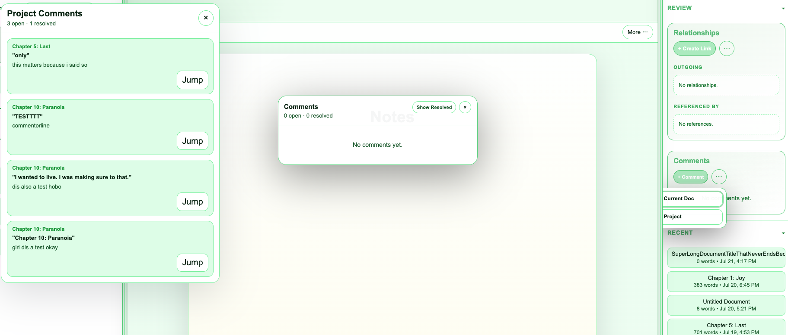
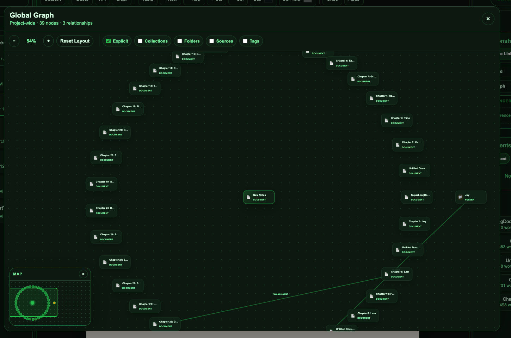

# NaviWriter

**NaviWriter** is an offline-first writing workspace for drafting, organizing, outlining, reviewing, and exporting long-form writing projects.

It was built as a browser-based writing tool inspired by apps like Scrivener and Reedsy, but designed to run locally on the web. It is especially useful for novels, serialized fiction, research-heavy projects, worldbuilding, and large writing projects with many connected documents.

The name is inspired by the excellent project **Navidrome**. NaviWriter is not related to Navidrome; I just liked the naming pattern and spiritually borrowed the vibe. Respectfully. Don't sue me.  

---

## What NaviWriter Is

NaviWriter is a local writing application that runs in the browser.

It includes tools for:

- Writing and formatting documents
- Managing manuscripts, chapters, notes, and research
- Organizing documents with folders and collections
- Tracking metadata and custom metadata
- Creating inline comments and project-wide review notes
- Building relationships between documents
- Viewing local and global relationship graphs
- Planning visually with a whiteboard/corkboard mode
- Using an outliner for project-wide document review
- Managing research sources
- Exporting and backing up projects
- Switching between desktop, compact, mobile, and focus layouts

It is not intended to be a polished commercial product. It is a working local writing suite built through a lot of iterative development, trial, error, stubbornness, and a suspicious amount of Copilot.

---

## Project Status

NaviWriter is currently considered **complete enough for release**.

That does **not** mean it is perfect.

You may encounter:

- Bugs
- UI quirks
- Browser-specific issues
- Layout weirdness
- Performance problems on very large projects
- Export limitations
- Code that looks like it survived a storm

I do not currently plan to actively maintain NaviWriter long-term. If you want to improve it, fork it, modify it, submit an issue, or open a pull request.

If someone wants to clean up the CSS or app structure, please do. I will not stop you. I may even gratefully steal your improvements.

---

## Credits and Development Notes

NaviWriter was created and directed by me, a human.

Most of the code was generated with **Microsoft Copilot Thinking Mode**, with occasional input from Gemini Flash and other Copilot modes.

I know very little about traditional software development. My role in the project was mostly:

- Designing the features
- Testing the app
- Reviewing behavior
- Asking for fixes
- Directing the UI/UX
- Breaking things
- Unbreaking things
- Saying “wait, what if…” far too many times

So if you open the code and find something strange, please have mercy.

The project works, but the internals are large. In particular:

- `app.js` is very large.
- `app.css` is very large.
- The CSS contains many late-stage overrides from feature polish and responsive layout fixes.
- The app is feature-first, not architecture-first.

In other words: it lives. It works. And it most certainly has scars.

---

## Download / Installation

You can use NaviWriter in either of two ways:

### Option 1: Single-file version

Download:

`NaviWriter Portable V2.html`

Then open it in a modern browser.

### Option 2: ZIP version

Download:

`NaviWriter V28 (FINAL V2).zip`

Extract the ZIP, then open:

index.html

in a browser.

Preferably use a Chromium-based browser such as:

- Chrome
- Microsoft Edge
- Brave
- Vivaldi

Other browsers may work, but Chromium browsers are the safest bet.

And yes, the version number skipped 27. Do not ask. I do not like that number.

---

## Quick Start

1. Open NaviWriter in a modern browser.
2. Create a new document from **New → New Document**.
3. Start writing in the main editor.
4. Use the **Details** tab to add metadata.
5. Use **Comments** for revision notes.
6. Use **Outliner** to review your project.
7. Use **File** to export or back up your work.

Most importantly: export backups regularly.

---

## Important Backup Warning

NaviWriter stores work locally in the browser unless you export or back up your project.

That means your data can be affected by:

- Clearing browser storage
- Switching browsers
- Browser privacy settings
- School/work device restrictions
- Local device issues
- Browser crashes
- Accidental deletion

Please back up your work regularly.

Recommended backup habits:

- Keep a normal local copy
- Keep an external drive copy
- Keep a cloud copy
- Export project backups before major edits
- Export backups before importing, deleting, or restructuring documents

Browser storage is convenient. It is not a life plan--and I say that from experience.

---

## Feature Overview

### NaviWriter includes:

- Rich text writing editor
- Manuscript and document management
- Subdocuments
- Folders
- Collections
- Outliner
- Custom metadata
- Inline comments
- Resolved comments
- Project-wide comments view
- Relationship tracking
- Local relationship graph
- Global relationship graph
- Relationship dashboard
- Research sources
- Whiteboard / corkboard mode
- Board minimap
- Document map / heading outline
- Split editor
- Export and compile tools
- Project metadata
- Project backups
- Snapshots
- Themes
- Focus mode
- Desktop / compact / mobile layouts

### Using NaviWriter

When NaviWriter opens, you will see the main writing workspace.

The default desktop layout includes:

- A Documents sidebar on the left
- The main editor/workspace in the center
- An Inspector panel on the right
- A top menu bar for project actions
- A status bar at the bottom

### Creating Documents

Use the New menu in the top bar to create project items.

Available options include:

- New Document — creates a normal writing document.
- New Manuscript — creates a manuscript-style document.
- Subdoc — creates a subdocument under the current document.

Documents appear in the left sidebar. Select a document from the sidebar to open and edit it.

Use the Document menu to:

- Duplicate the current document
- Rename the current document
- Delete the current document

### Writing in the Editor

The center area is the main editor.

Click into the page and begin typing.

The formatting toolbar includes:

- Paragraph style
- Font selection
- Font size
- Bold
- Italic
- Underline
- Strikethrough
- Text color
- Highlight
- Bulleted lists
- Numbered lists
- Alignment
- Indent and outdent
- Quotes
- Horizontal rules
- Tables
- Undo and redo

The editor autosaves while you work.

The bottom status bar shows useful writing information such as:

- Save status
- Word count
- Character count
- Theme controls

### Documents Sidebar

The left sidebar shows your project documents.

Document cards may include:

- Document title
- Document type
- Word count
- Last edited date/time
- Folder indicators
- Collection indicators
- Status indicators
- Comment indicators
- Metadata indicators

Use the sidebar search field to find documents by title, tags, status, or other searchable information.

Use the folder filter to view documents from a specific folder or all documents.

### Document Details and Metadata

The right-side Inspector includes a Details tab for document information.

Document metadata can include:

- Folder
- Status
- POV
- Location
- Timeline
- Characters
- Tags
- Summary
- Custom metadata fields

Custom metadata lets you create project-specific fields.

Example custom fields might include:

- Scene Purpose
- Canon Level
- Arc Weight
- Continuity Risk
- Emotional Temperature
- Draft Priority

Custom metadata fields can be:

- Text
- Long text
- Dropdown
- Checkbox
- Number
- Date

Filled custom metadata fields appear in the main Custom Metadata area for each document. Empty fields are tucked into Other Fields so the sidebar does not become a giant metadata landfill.

### Inspector Tabs

The Inspector is divided into three main tabs:

#### Details

Use this tab for document information and metadata.

This includes:

- Built-in metadata
- Custom metadata
- Summary
- Document details

#### Review

Use this tab for review and connection tools.

This includes:

- Relationships
- Comments
- Project comments
- Recent documents

##### Relationships and Graphs

NaviWriter supports relationships between documents.

In the Review tab, use the Relationships card to create and view document links.

Relationships can be used to track:

- Character connections
- Plot dependencies
- Research references
- Worldbuilding links
- Scene-to-scene relationships
- Continuity links

Relationship tools include:

- Creating links
- Viewing outgoing relationships
- Viewing backlinks
- Opening the relationship dashboard
- Viewing a local graph
- Viewing global/project-level graph relationships

This helps turn large writing projects into a connected workspace instead of a loose pile of documents.

##### Comments and Review Workflow

NaviWriter supports inline comments.

To add a comment:

1. Select text in the editor.
2. Click + Comment in the Comments area.
3. Enter your note.

The selected text will be highlighted.
The comment will appear in the comments system.

Comments can be:

- Open
- Resolved
- Reopened
- Deleted

Use the comments drawer to review comments for the current document.

Use Project Comments to review comments across the entire project. This is useful when revising multiple chapters or tracking unfinished editing notes across many documents.

Resolved comments can be hidden or shown.

#### Analysis

Use this tab for writing analysis and navigation.

This includes:

- Find / Replace
- Outline / Document Map
- Long-term goals
- Temporary goals
- Writing statistics
- Repeated words
- Section counts

#### Outline / Document Map

The Outline section in the Analysis tab displays headings detected in the current document.

Use it to jump between sections of a long document.

If the document has no headings, the outline will show an empty state.

Use the refresh button if the outline does not update immediately after editing headings.

##### Goals and Statistics

NaviWriter includes writing goal tools in the Analysis tab.

You can set:

- A long-term deadline goal
- A target word count
- A target date
- A temporary writing goal

The Stats section can show:

- Words
- Characters
- Paragraphs
- Headings
- Reading time
- Session words

Repeated word and phrase tools can help identify overused language in the current document or selected analysis scope.

---

## Other Tools

### Whiteboard / Board Mode

Some documents can use Board Mode, which lets you visually organize notes and ideas.

Board Mode supports:

- Notes
- Images
- Links
- People
- Connections between items

Use Board Mode for:

- Plot planning
- Character relationship mapping
- Research clustering
- Scene organization
- Brainstorming
- Visual outlining

Board tools include:

- Adding items
- Connecting items
- Moving items
- Resizing notes
- Changing item colors
- Zooming
- Undo and redo
- Exporting the board

The board minimap helps navigate larger boards by showing a small overview of the board layout.

### Research Sources

NaviWriter includes a Research Sources system for storing project references.

Sources can track:

- Research notes
- Web links
- Source titles
- Authors
- Notes
- Related documents

Use the Sources workspace mode to manage research material separately from manuscript writing.

This is useful for projects with research, references, worldbuilding notes, or continuity tracking.

### Collections

Collections let you group documents without moving them from their original folder or hierarchy.

Use Collections for:

- Draft groups
- Character arcs
- Revision passes
- Research bundles
- Scene batches
- Theme-based document groups

Open Collections from the Workspace menu.

A document can belong to one or more collections.

### Outliner

The Outliner gives a table-style overview of project documents.

Use it to review documents by:

- Title
- Type
- Status
- Word count
- POV
- Location
- Folder
- Collections
- Updated date
- Optional custom metadata columns

The Outliner also includes relationship-focused views for reviewing document connections.

Use Custom Columns to choose which custom metadata fields appear in the Outliner.

This is especially useful for large projects where you want to compare chapter-level or scene-level information across many documents.

### Split Editor

The Split Editor lets you open a second document beside the current one.

Use it when you want to:

- Reference another chapter
- Compare two scenes
- Edit a related note
- Check research while writing
- Rename or lightly edit another document without leaving your current document

The split editor supports basic editing and autosaves changes to the split document.

For heavier formatting or major rewrites, open the split document as the main document.

### File, Export, and Backup Tools

Use the File button in the top bar to access project and export tools.

File tools may include:

- Exporting or compiling documents
- Choosing export profiles
- Selecting document types to include
- Project metadata
- Project backup export
- Project backup import
- Snapshots
- Endnotes
- Document splitting tools

When exporting, NaviWriter strips editing-only UI such as inline comment markup from exported manuscript content.

For safety, export backups regularly.

Recommended backup habits:

- Keep one copy in normal device storage
- Keep one copy on an external drive
- Keep one copy in cloud storage
- Create backups before major editing sessions
- Create backups before importing, deleting, or restructuring documents

Browser storage is useful, but backups are your insurance policy.

### Layout Modes

NaviWriter includes layout modes for different screen sizes.

Use the View or Layout menu to choose:

- Auto — automatically switches layout based on screen size
- Desktop — full three-column layout
- Compact — drawer-based layout for smaller laptop or tablet widths
- Mobile — phone-friendly layout with drawers and compact controls

In Compact and Mobile modes:

- The document sidebar becomes a drawer
- The inspector becomes a drawer
- Docs and Inspector buttons appear near the top
- The editor gets more space
- The toolbar becomes horizontally scrollable when needed
- The status bar becomes simplified

Use Auto mode if you want NaviWriter to choose the best layout automatically.

### Focus Mode

Focus Mode hides most of the interface so you can concentrate on writing.

Use the Focus button to enter focus mode.

In Focus Mode:

- Sidebars are hidden
- Toolbars are hidden
- Status bars are hidden
- The editor is centered
- The document page becomes the main focus

Use Exit Focus to return to the normal interface.

Focus Mode is useful for drafting, revision passes, or distraction-free writing sessions.

### Themes

NaviWriter includes theme support.

Use the theme controls to switch between available themes.

Themes affect:

1. Panels
2. Buttons
3. Borders
4. Highlights
5. Editor chrome
6. Interface colors

If something looks strange after switching themes, try toggling layout mode or refreshing the app.

---

## Saving and Local Storage

NaviWriter is designed to work locally in the browser.

Documents and settings may be stored using browser storage.

Because browser storage can be affected by clearing site data, changing browsers, or device restrictions, you should not treat it as your only copy.

Back up your project regularly.

Export backups before:

- Major revisions
- Large imports
- Deleting documents
- Reorganizing folders
- Testing experimental changes
- Updating the app files

## Suggested Workflow

A typical workflow might look like this:

- Create a manuscript or main project document.
- Add chapters or subdocuments.
- Use metadata to track status, POV, location, timeline, and tags.
- Use custom metadata for project-specific tracking.
- Use the Outliner to review the project at a high level.
- Use Comments to leave revision notes.
- Use Project Comments to review unresolved notes across the project.
- Use Relationships and Graphs to connect related documents.
- Use Board Mode for planning or visual organization.
- Use Focus Mode when drafting.
- Use File tools to export, compile, or back up the project.

## Tips

- Use folders for broad organization.
- Use collections for flexible groups that do not need to match folders.
- Use custom metadata sparingly at first. Add fields only when they help you make decisions.
- Use comments for revision tasks, not permanent notes.
- Use relationships for meaningful connections, not every tiny association.
- Use Focus Mode when writing.
- Use the Outliner when reviewing.
- Back up before big changes.
- If the interface feels crowded, try Compact or Mobile layout mode even on desktop.

## Known Limitations

NaviWriter is complete enough to use, but not perfect.

Known limitations include:

- Very large projects may affect performance.
- Browser storage should not be treated as a permanent backup.
- EPUB export is not currently included.
- PDF export may need improvement.
- The split editor is intentionally basic.
- The stylesheet is very large.
- The codebase may be difficult to maintain without refactoring.
- Some features may depend on browser support or online CDN availability.

---

## Contribution Wishlist

If you want to improve NaviWriter, these are welcome areas:

- CSS refactor: split app.css into modules
- CSS refactor: consolidate responsive rules
- CSS refactor: normalize inspector/sidebar/workspace panel shell styles
- CSS refactor: remove legacy override blocks
- Feature: EPUB export
- Feature: improved PDF export
- Feature: advanced split editor formatting
- Accessibility improvements
- Performance improvements
- Additional export formats
- Better mobile polish
- Code organization improvements

---

## Final Note

NaviWriter was built by someone who wanted a powerful local writing workspace and did not know enough code to be afraid of building one.

That may explain a lot.

If this project is useful to you, wonderful. If you improve it, even better. If you open app.js and whisper “what happened here,” just know that I probably said the same thing.

But you know what?

Such is life.

And in life, we move on.

And before I forget, NaviWriter is designed to run locally in the browser. Project data is stored locally unless exported or backed up by the user.

NaviWriter does not include a server backend because God knows I can't afford that, nor can I maintain it.

## License

This project is licensed under the MIT License.

See the `LICENSE` file for details.

## Attribution

If you build upon NaviWriter, please keep attribution intact.

Forks, improvements, modifications, and community contributions are welcome.

If you somehow become rich selling an unchanged copy of NaviWriter, at least have the decency to feel slightly guilty.

Thanks! 🤭

---

## Screenshots

> Screenshots are examples of NaviWriter’s interface. Exact appearance may vary depending on browser, theme, layout mode, and screen size.

### Desktop Writing Workspace

### Compact / Mobile Layout

### Whiteboard / Board Mode

### Outliner

### Comments and Review Tools

### Relationship Graph

---

## Most Recent Builds

- `NaviWriter Portable V2.html` — single-file build
- `NaviWriter V28 (FINAL V2).zip` — multi-file build
